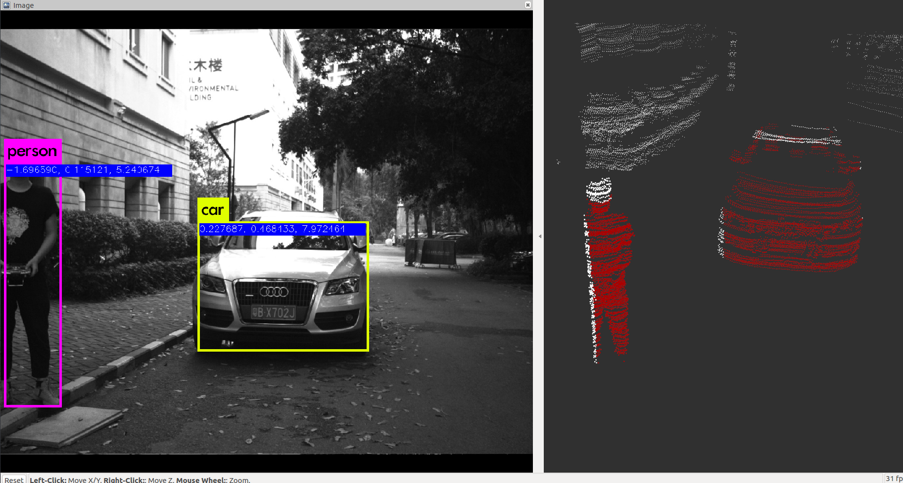

# cam_lidar_fusion

Simultaneously Calibration camere and lidar's extrins parameter, and project point cloud on image.
-------------
## TODO:

- [x] camera's front-end //  Use [A-LOAM](https://github.com/HKUST-Aerial-Robotics/A-LOAM)
- [ ] lidar's front-end
- [ ] construct non-linear calib problem.
- [X] projection[kitti_dataset.]:
  

## usage

Currentely I have calibrate camera and lidar by this [ros package](https://github.com/ankitdhall/lidar_camera_calibration). 

After calib, I implement an enhanced yolo detection result -- result with xyz coordinate in camera coordinates.

Here's the work on KITTI dataset(I am still continue constructing it.)

<!--  -->

## Related paper
[LiDAR and Camera Calibration using Motion Estimated by Sensor Fusion Odometry](https://arxiv.org/abs/1804.05178)
